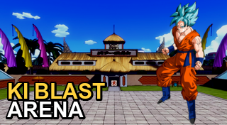

# Ki Blast Arena

A PlayStation 3 homebrew port of **Power of Pong** — a Dragon Ball-style 1v1
arena fighter that mixes pong/paddle mechanics with charged **ki** energy blasts.
Two fighters trade paddle strikes and launch ki blasts at three power levels in a
**power tug-of-war** (fill your bar to win the round), with a CPU opponent driven by
a finite-state machine.

The original is a Unity 2018 game (`powerofpong`); this repo re-implements it from
scratch in C on the PSL1GHT SDK, following the conventions of
[02900/ps3-homebrew-template](https://github.com/02900/ps3-homebrew-template) and
[02900/ps3-remote-play](https://github.com/02900/ps3-remote-play).

> ## ✅ Status: playable
> A full game loop: **mode menu → character select → fight → result → menu**. Three
> modes (Battle / Tournament / Mission), the **30-fighter roster** with per-character
> art and power, **7 arenas**, original music + SFX, 1P-vs-CPU or 2-pad local play, and
> an installable **PKG** for the XMB. See **[todo/ROADMAP.md](todo/ROADMAP.md)** for the
> phase-by-phase history and remaining polish.



---

## Building

You need the PSL1GHT toolchain. The easiest way is the prebuilt Docker image — no
local install, works on macOS/Windows/Linux. Mount the project at `/src` and run a
command inside the image:

```bash
# Build  ->  produces src.elf / src.self in the project root
docker run --rm -v "$PWD":/src -w /src ghcr.io/02900/ps3-toolchain make

# Build an installable PKG (for XMB)
docker run --rm -v "$PWD":/src -w /src ghcr.io/02900/ps3-toolchain make pkg

# Clean
docker run --rm -v "$PWD":/src -w /src ghcr.io/02900/ps3-toolchain make clean
```

Or use the helper wrappers:

```bash
./scripts/build.sh            # build
./scripts/build.sh pkg        # installable PKG
./scripts/build.sh clean      # clean
```

> **Platform notes**
> - **Apple Silicon (M1/M2/…):** add `--platform linux/amd64` to every `docker run`
>   (the image is x86_64; Docker emulates it).
> - **Windows:** run the commands from a **WSL2** shell.
> - **Linux:** if your user isn't in the `docker` group, prefix with `sudo`.

Because the project is mounted at `/src`, the build is named after that directory,
so the outputs are **`src.elf`**, **`src.self`** and **`src.fake.self`**.

## Sending to a PS3 (ps3load)

With **PS3LoadX running on the console** (listening on TCP `4299`):

```bash
PS3_IP=192.168.1.13 ./scripts/deploy.sh
```

The `--network host` flag (set inside the script) lets the container reach the PS3
on your LAN — without it the loader receives the file but never launches it.

## Install on the PS3 (PKG, runs from the XMB)

Build an installable package:

```bash
./scripts/build.sh pkg          # or: docker run ... ghcr.io/02900/ps3-toolchain make pkg
```

This produces **`src.pkg`** in the project root (a self-contained NPDRM package — all
art, audio and code are embedded, no extra files needed). To install on a PS3 with CFW/HEN:

1. Copy `src.pkg` to the console (USB stick, or FTP to `/dev_hdd0/`).
2. On the PS3, open **Package Manager → Install Package Files** and pick `src.pkg`.
3. Launch **Ki Blast Arena** from the XMB (Game column). The icon is `pkgfiles/ICON0.PNG`.

> The package's `TITLE_ID` is `KIBLASTAR` and the title is set in `sfo.xml`.

---

## Project structure

```
ki-blast-arena/
├── .github/workflows/   # CI: build (via toolchain image) + docs link lint
├── source/              # C game source (PPU) — main.c, audio.c, ttf_render.c
├── include/             # Shared headers
├── data/                # Embedded assets (bin2o): character/arena art, audio
├── pkgfiles/            # Files bundled into the PKG (ICON0.PNG, assets/)
├── extern/              # External deps (Clay UI submodule)
├── .claude/skills/      # Submodule: ps3-homebrew patterns, as Claude skills (ps3-homebrew-skills)
├── docs/api/            # Per-library API notes
├── scripts/             # Dockerized build.sh / deploy.sh wrappers
├── todo/                # → ROADMAP.md: the migration plan
├── Makefile             # PSL1GHT build
├── sfo.xml              # Application metadata (TITLE_ID: KIBLASTAR)
└── README.md
```

## Toolchain & libraries

Built against the libraries the toolchain image ships: **Tiny3D** (3D), **YA2D**
(2D sprites), **FreeType** (TTF text), **MikMod** (audio), **libcurl**/**PolarSSL**,
**Mini18n**, plus the PSL1GHT pad/audio/sysutil APIs. The **Clay** UI layout engine
(`extern/clay-ps3`) renders the menus, character-select grid, and the in-fight HUD.

## Roadmap

The full, phase-by-phase migration plan is in **[todo/ROADMAP.md](todo/ROADMAP.md)**.

## Patterns & gotchas

Reusable conventions and traps hit while porting (PSL1GHT pad quirks, Tiny3D colour
formats, deterministic camera, MikMod audio, Unity-port tips) now live in the shared
**[`.claude/skills/ps3-homebrew/`](https://github.com/02900/ps3-homebrew-skills)** submodule —
vendored once and used as Claude Code skills, so every port stays in sync. Run
`git submodule update --init` to fetch it; read it before adding input or rendering code.
(`docs/PATTERNS.md` is now just a pointer there.)

## Credits

- Original game: **Power of Pong** (Unity) — its music (`battle ambient`) and SFX
  (`meleehit`, `basicbeam_fire`, `kiplosion`) are reused, converted to PCM WAV and
  embedded.
- Toolchain & structural conventions: [02900/ps3-toolchain](https://github.com/02900/ps3-toolchain),
  [02900/ps3-homebrew-template](https://github.com/02900/ps3-homebrew-template),
  [02900/ps3-remote-play](https://github.com/02900/ps3-remote-play).

## License

MIT.
